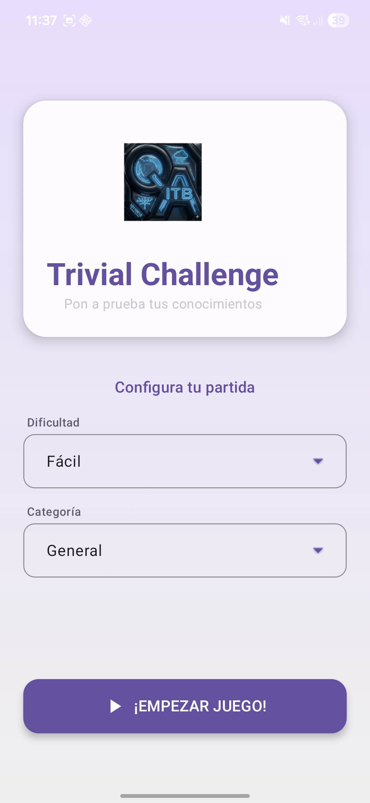
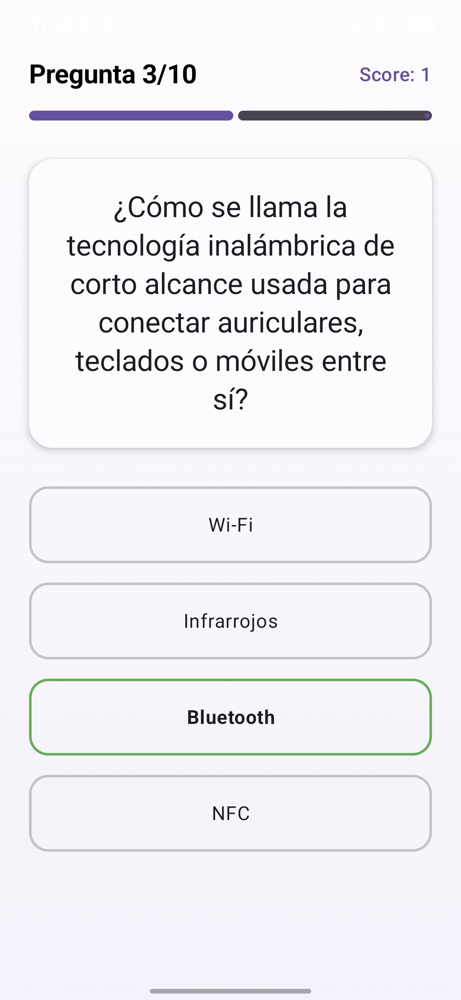
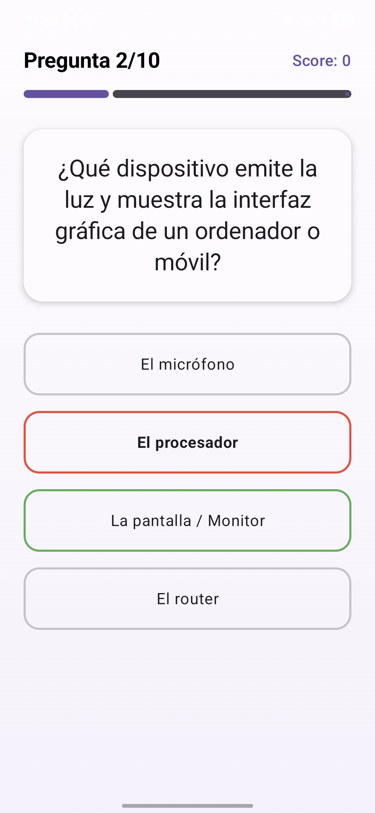
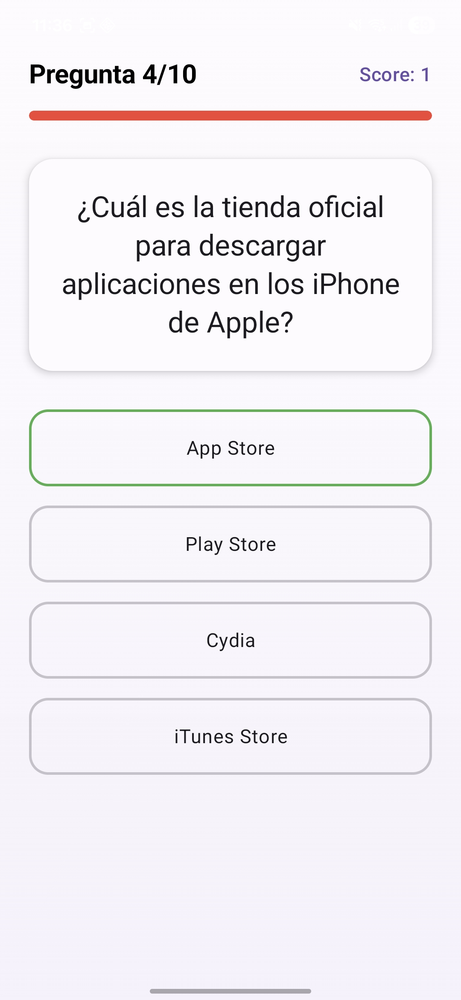
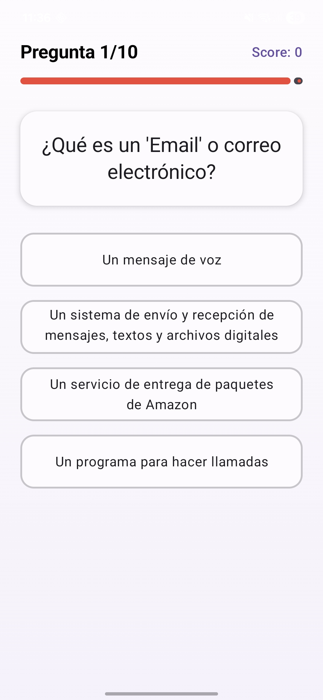
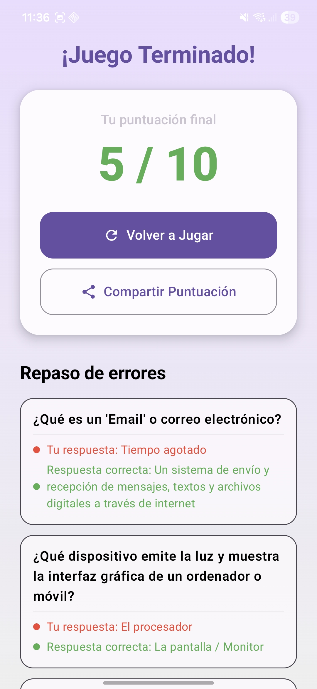
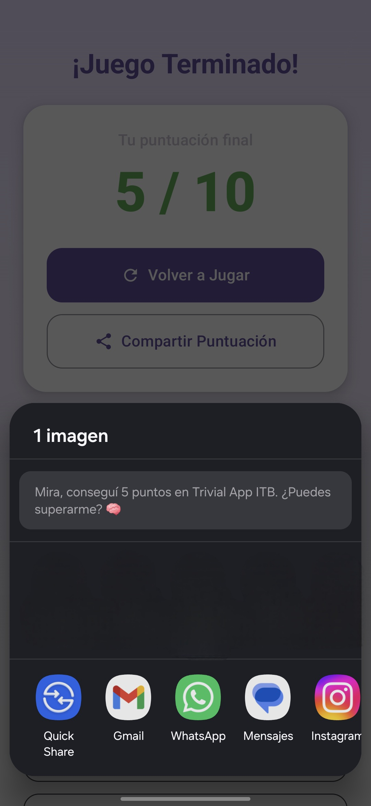

# Trivial-App

Trivia-App es un juego de preguntas y respuestas sobre informática desarrollado en **Kotlin** y **Jetpack Compose**. Desafía tus conocimientos tecnológicos a través de múltiples categorías y dificultades, desde principiante hasta experto, con una interfaz moderna y fluida.

---

## Características principales

- **Interfaz Declarativa:** Construida totalmente con Jetpack Compose para una experiencia fluida
- **Sistema de Preguntas:** Base de datos extensa de preguntas sobre informática
- **Múltiples Categorías:** Diferentes temas especializados en tecnología
- **Niveles de Dificultad:** Desde principiante hasta experto
- **Temporizador Dinámico:** Cuenta regresiva con visual intuitiva
- **Barra de Progreso Inteligente:** Cambia de color cuando el tiempo se agota
- **Sistema de Puntuación:** Seguimiento completo del desempeño
- **Compartir Resultados:** Opción para enviar tu puntuación final
- **Modo Oscuro:** Soporte para temas claros y oscuros
- **Experiencia Fluida:** Animaciones suaves y transiciones elegantes

---

## Capturas de Pantalla

### Inicio del Juego
Pantalla principal y menú para comenzar la experiencia.

| Menú Inicial |
| :---: |
|  |

### Gameplay
Sistema de validación de respuestas y temporizador en acción.

| Respuesta Correcta | Respuesta Errónea | Tiempo Agotado |
| :---: | :---: | :---: |
|  |  |  |

### Progreso y Finalización
Indicador visual de progreso y pantalla de resultados.

| Barra de Tiempo | Resultado Final | Compartir Resultados |
| :---: | :---: | :---: |
|  |  |  |

---

## Tecnologías utilizadas

* **Lenguaje:** [Kotlin](https://kotlinlang.org/)
* **UI Framework:** [Jetpack Compose](https://developer.android.com/jetpack/compose)
* **Entorno de Desarrollo:** Android Studio
* **Gestión de Estado:** ViewModel + StateFlow
* **Base de Datos:** Local (almacenamiento de preguntas y resultados)
* **Arquitectura:** MVVM (Model-View-ViewModel)
* **Animaciones:** Jetpack Compose Animations
* **Concurrencia:** Coroutines

---

## Flujo del Juego

1. **Pantalla de Inicio** - Menú principal para comenzar
2. **Selección de Categoría** - Elige el tema de tus preguntas
3. **Selección de Dificultad** - Elige nivel (Principiante, Intermedio, Experto)
4. **Juego** - Responde preguntas con temporizador activo
5. **Validación** - Sistema indica si es correcto o incorrecto
6. **Puntuación** - Pantalla final con tu desempeño
7. **Compartir** - Opción para enviar resultados a otros

---

## Instalación y Uso

1. Clona este repositorio:
   ```bash
   git clone https://github.com/elvinpoma/Trivial-App.git
   ```
2. Abre el proyecto en **Android Studio**
3. Sincroniza el proyecto con los archivos de Gradle
4. Ejecuta la aplicación en un emulador o dispositivo físico
